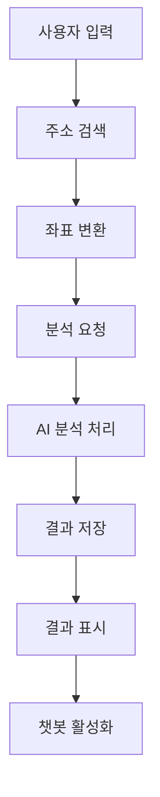
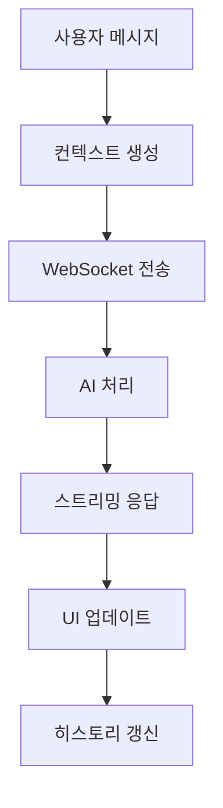
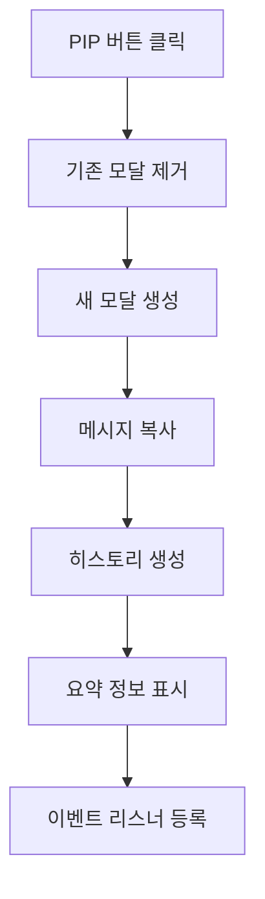

# AI_Analyzer PIP 기능 개발 보고서

## 📋 프로젝트 개요

**개발 일자**: 2025년 6월 18일  
**개발자**: AI Assistant  
**프로젝트**: LocaAI - AI_Analyzer 챗봇 PIP(Picture-in-Picture) 확대 기능 개발  
**목표**: 사용자 경험 개선을 위한 챗봇 UI 최적화 및 PIP 모드 구현

---

## 🎯 주요 개발 목표

1. **챗봇 입력 필드 크기 최적화** - 전체 UI와의 시각적 일관성 확보
2. **PIP 확대 모드 구현** - 채팅을 확대된 화면에서 볼 수 있는 기능
3. **채팅 히스토리 기능** - PIP 모드에서 대화 기록 관리
4. **실시간 동기화** - 원본과 PIP 간 메시지 동기화
5. **사용자 경험 최적화** - 직관적이고 편리한 인터페이스

---

## 🔧 구현된 기능

### 1. 챗봇 입력 필드 크기 조정

#### 변경 사항
- **이전**: `form-control-lg`, `btn-lg` 클래스 사용 (큰 크기)
- **현재**: `form-control`, `btn` 클래스 사용 (표준 크기)

#### 코드 변경
```html
<!-- 이전 -->
<input type="text" id="chatInput" class="form-control-lg" placeholder="분석 결과에 대해 궁금한 점을 물어보세요...">
<button class="btn btn-primary btn-lg" id="chatSendBtn" type="button">

<!-- 현재 -->
<input type="text" id="chatInput" class="form-control" placeholder="분석 결과에 대해 궁금한 점을 물어보세요...">
<button class="btn btn-primary" id="chatSendBtn" type="button">
```

#### 효과
- 전체 UI와의 시각적 조화 개선
- 페이지 레이아웃의 균형감 향상
- 모바일 환경에서의 사용성 개선

### 2. PIP(Picture-in-Picture) 확대 모드 구현

#### 2.1 PIP 모달 구조

```html
<div id="chatbotPIPModal" style="position: fixed; top: 0; left: 0; width: 100%; height: 100%; background-color: rgba(0,0,0,0.8); z-index: 10003;">
  <div class="d-flex flex-column h-100">
    <!-- PIP 헤더 -->
    <div class="bg-white border-bottom px-4 py-3">
      <!-- AI 브랜딩 및 컨트롤 버튼 -->
    </div>
    
    <!-- PIP 채팅 영역 -->
    <div class="flex-grow-1 bg-light d-flex">
      <!-- 채팅 히스토리 사이드바 (280px) -->
      <div class="bg-white border-end" style="width: 280px;">
        <!-- 채팅 히스토리 -->
      </div>
      
      <!-- 채팅 메시지 영역 (중앙) -->
      <div class="flex-grow-1 d-flex flex-column">
        <!-- 메시지 표시 영역 -->
      </div>
      
      <!-- 분석 요약 사이드바 (350px) -->
      <div class="bg-white border-start" style="width: 350px;">
        <!-- 분석 요약 정보 -->
      </div>
    </div>
  </div>
</div>
```

#### 2.2 PIP 모달 특징

- **전체 화면 모달**: `100vw × 100vh` 크기
- **3단 레이아웃**: 히스토리 | 채팅 | 분석요약
- **동적 생성**: JavaScript로 필요시에만 DOM에 추가
- **완전 제거**: 닫을 때 DOM에서 완전히 제거하여 메모리 최적화

#### 2.3 핵심 JavaScript 함수

```javascript
// PIP 모달 열기
function openChatbotPIP() {
  // 기존 모달 제거
  const existingModal = document.getElementById('chatbotPIPModal');
  if (existingModal) {
    existingModal.remove();
  }
  
  // 새로운 PIP 모달 생성
  const pipModal = document.createElement('div');
  pipModal.id = 'chatbotPIPModal';
  // ... 모달 구조 생성
  
  // DOM에 추가
  document.body.appendChild(pipModal);
  
  // 기존 채팅 메시지 복사
  // 채팅 히스토리 업데이트
  // 분석 요약 정보 업데이트
}

// PIP 모달 닫기
function closeChatbotPIP() {
  const pipModal = document.getElementById('chatbotPIPModal');
  if (pipModal) {
    pipModal.remove(); // DOM에서 완전 제거
  }
}
```

### 3. 채팅 히스토리 기능

#### 3.1 히스토리 구조

```html
<div id="pipChatHistory">
  <div class="border rounded p-2 mb-2 cursor-pointer hover-bg-light" onclick="scrollToPIPMessage(1)">
    <div class="d-flex align-items-start">
      <div class="bg-primary rounded-circle me-2">
        <i class="bi bi-person-fill text-white"></i>
      </div>
      <div class="flex-grow-1">
        <div class="small fw-bold text-primary mb-1">질문 1</div>
        <div class="small text-dark mb-1">사용자 질문 미리보기...</div>
        <div class="small text-muted">AI 답변 미리보기...</div>
      </div>
    </div>
  </div>
</div>
```

#### 3.2 히스토리 기능

- **세션 그룹화**: 사용자 질문을 기준으로 대화 세션 분리
- **미리보기**: 질문 30자, 답변 40자 미리보기
- **클릭 네비게이션**: 히스토리 클릭 시 해당 메시지로 자동 스크롤
- **하이라이트 효과**: 클릭한 메시지 2초간 하이라이트
- **실시간 업데이트**: 새 메시지 추가 시 자동으로 히스토리 갱신

#### 3.3 히스토리 업데이트 함수

```javascript
function updatePIPChatHistory() {
  const historyDiv = document.getElementById('pipChatHistory');
  const chatMessages = document.getElementById('chatMessages');
  
  // 대화 세션을 시간순으로 그룹화
  let historyHTML = '';
  let currentSession = [];
  let sessionCount = 0;

  messages.forEach((message, index) => {
    const isUser = message.querySelector('.ms-auto') !== null;
    const messageText = message.querySelector('.bg-primary, .bg-white')?.textContent?.trim() || '';
    
    if (isUser) {
      // 새로운 세션 시작
      if (currentSession.length > 0) {
        sessionCount++;
        historyHTML += createHistorySession(currentSession, sessionCount);
        currentSession = [];
      }
      currentSession.push({ type: 'user', text: messageText });
    } else {
      currentSession.push({ type: 'ai', text: messageText });
    }
  });
  
  historyDiv.innerHTML = historyHTML;
}
```

### 4. 실시간 메시지 동기화

#### 4.1 양방향 동기화

- **원본 → PIP**: 원본 채팅에서 메시지 전송 시 PIP에도 동시 표시
- **PIP → 원본**: PIP에서 메시지 전송 시 원본 채팅에도 동시 표시
- **WebSocket 통합**: 하나의 WebSocket 연결로 모든 인터페이스 동기화

#### 4.2 동기화 구현

```javascript
// PIP 메시지 전송
function sendPIPMessage() {
  const input = document.getElementById('pipChatInput');
  const message = input.value.trim();
  
  if (!message || !chatSocket) return;
  
  // 사용자 메시지 추가 (PIP와 원본 모두)
  addPIPUserMessage(message);
  addUserMessage(message);
  
  // WebSocket으로 메시지 전송
  chatSocket.send(JSON.stringify({
    user_id: '{{ user.id }}',
    session_id: currentSessionId,
    question: contextualMessage,
    collection: 'analysis_result_consultation'
  }));
  
  // 봇 응답 준비 (PIP와 원본 모두)
  preparePIPBotMessage();
  prepareBotMessage();
  
  // 히스토리 업데이트
  setTimeout(() => {
    updatePIPChatHistory();
  }, 100);
}
```

#### 4.3 WebSocket 메시지 처리

```javascript
chatSocket.onmessage = function(e) {
  const data = JSON.parse(e.data);
  
  if (data.chunk) {
    // 스트리밍 응답 처리 (원본과 PIP 동시 업데이트)
    appendToCurrentBotMessage(data.chunk);
  } else if (data.done) {
    // 응답 완료 처리
    finalizeBotMessage();
    // PIP 히스토리 업데이트
    setTimeout(() => {
      updatePIPChatHistory();
    }, 100);
  }
};
```

### 5. 분석 요약 사이드바

#### 5.1 요약 정보 구조

```javascript
function updatePIPAnalysisSummary() {
  const summaryDiv = document.getElementById('pipAnalysisSummary');
  
  // 현재 분석 결과에서 주요 지표 가져오기
  const address = document.getElementById('resultAddress')?.textContent || '-';
  const businessType = document.getElementById('resultBusinessType')?.textContent || '-';
  const survivalRate = document.getElementById('survivalPercentage')?.textContent || '-%';
  
  summaryDiv.innerHTML = `
    <div class="mb-3">
      <h6 class="text-primary mb-2">📍 기본 정보</h6>
      <div class="small">
        <div class="mb-1"><strong>주소:</strong> ${address}</div>
        <div class="mb-1"><strong>업종:</strong> ${businessType}</div>
      </div>
    </div>
    
    <div class="mb-3">
      <h6 class="text-success mb-2">🎯 AI 생존 확률</h6>
      <div class="text-center">
        <div class="h4 text-primary mb-1">${survivalRate}</div>
        <div class="progress mb-2" style="height: 8px;">
          <div class="progress-bar ${getSurvivalBarClass(survivalRate)}" style="width: ${survivalRate}"></div>
        </div>
      </div>
    </div>
    
    <!-- 추가 지표들... -->
  `;
}
```

#### 5.2 표시 정보

- **기본 정보**: 주소, 업종, 면적
- **AI 생존 확률**: 백분율 및 진행바
- **핵심 지표**: 생활인구, 직장인구, 경쟁업체, 공시지가
- **경쟁강도 분석**: 경쟁업체 비율, 업종 다양성
- **외국인 분석**: 단기/장기 체류자, 중국인 비율
- **연령대별 인구**: 20대~60대+ 분포

### 6. 추천 질문 기능

#### 6.1 추천 질문 버튼

```html
<div class="mb-3">
  <small class="text-muted fw-bold">💡 추천 질문</small>
  <div class="mt-2">
    <button class="btn btn-sm btn-outline-primary me-2 mb-2" onclick="fillPIPExampleQuestion('이 상권의 생존 확률이 높은 이유는 무엇인가요?')">
      <i class="bi bi-graph-up me-1"></i>생존 확률
    </button>
    <button class="btn btn-sm btn-outline-warning me-2 mb-2" onclick="fillPIPExampleQuestion('경쟁업체가 많은 편인가요?')">
      <i class="bi bi-shop me-1"></i>경쟁 현황
    </button>
    <button class="btn btn-sm btn-outline-success me-2 mb-2" onclick="fillPIPExampleQuestion('창업 시 주의해야 할 점은 무엇인가요?')">
      <i class="bi bi-exclamation-triangle me-1"></i>주의사항
    </button>
  </div>
</div>
```

#### 6.2 추천 질문 목록

1. **생존 확률** - "이 상권의 생존 확률이 높은 이유는 무엇인가요?"
2. **경쟁 현황** - "경쟁업체가 많은 편인가요?"
3. **주의사항** - "창업 시 주의해야 할 점은 무엇인가요?"

---

## 🚨 해결된 기술적 문제

### 1. 투명 오버레이 클릭 차단 문제

#### 문제 상황
- 페이지 로드 후 모든 요소가 클릭되지 않는 현상
- 투명한 오버레이가 전체 화면을 덮고 있는 상태

#### 원인 분석
- 주소 검색 모달의 닫기 오버레이가 `pointer-events: auto`로 설정
- 모달이 숨겨진 상태에서도 클릭 이벤트를 차단

#### 해결 방법
```html
<!-- 문제 코드 -->
<div onclick="closeAddressSearch()" style="position: absolute; top: 0; left: 0; width: 100%; height: 100%; z-index: 9998; pointer-events: auto;"></div>

<!-- 수정 코드 -->
<div onclick="closeAddressSearch()" style="position: absolute; top: 0; left: 0; width: 100%; height: 100%; z-index: 9998; pointer-events: none; display: none;"></div>
```

#### 추가 조치
```javascript
// 주소 검색 모달 열기 시
function openAddressSearch() {
  const addressModal = document.getElementById('addressSearchModal');
  addressModal.style.display = 'block';
  addressModal.style.pointerEvents = 'auto';
  
  // 닫기 오버레이 활성화
  const closeOverlay = addressModal.querySelector('div[onclick="closeAddressSearch()"]');
  if (closeOverlay) {
    closeOverlay.style.display = 'block';
    closeOverlay.style.pointerEvents = 'auto';
  }
}

// 주소 검색 모달 닫기 시
function closeAddressSearch() {
  const addressModal = document.getElementById('addressSearchModal');
  addressModal.style.display = 'none';
  addressModal.style.pointerEvents = 'none';
  
  // 닫기 오버레이 비활성화
  const closeOverlay = addressModal.querySelector('div[onclick="closeAddressSearch()"]');
  if (closeOverlay) {
    closeOverlay.style.display = 'none';
    closeOverlay.style.pointerEvents = 'none';
  }
}
```

### 2. PIP 모달 메모리 누수 방지

#### 문제 예방
- 정적 HTML 대신 동적 생성 방식 채택
- 모달 닫기 시 DOM에서 완전 제거
- 이벤트 리스너 자동 정리

#### 구현 방식
```javascript
function openChatbotPIP() {
  // 기존 PIP 모달이 있으면 제거 (메모리 누수 방지)
  const existingModal = document.getElementById('chatbotPIPModal');
  if (existingModal) {
    existingModal.remove();
  }
  
  // 새로운 PIP 모달 동적 생성
  const pipModal = document.createElement('div');
  // ... 모달 구성
  
  document.body.appendChild(pipModal);
}

function closeChatbotPIP() {
  const pipModal = document.getElementById('chatbotPIPModal');
  if (pipModal) {
    pipModal.remove(); // DOM에서 완전 제거
  }
}
```

---

## 🎨 UI/UX 개선사항

### 1. 디자인 일관성

#### AI_Analyzer 브랜딩
- **색상 테마**: Primary Blue (#0d6efd) 기반
- **아이콘**: Bootstrap Icons 사용
- **타이포그래피**: 일관된 폰트 크기 및 가중치

#### 반응형 디자인
- **모바일 최적화**: 작은 화면에서도 사용 가능
- **터치 친화적**: 버튼 크기 및 간격 최적화

### 2. 사용자 경험

#### 직관적 인터페이스
- **명확한 아이콘**: 각 기능별 구분되는 아이콘 사용
- **상태 표시**: 온라인/오프라인 상태 명확히 표시
- **로딩 인디케이터**: 스피너로 진행 상황 표시

#### 편의 기능
- **키보드 단축키**: Enter 키로 메시지 전송
- **자동 스크롤**: 새 메시지 시 자동으로 하단 스크롤
- **하이라이트 효과**: 클릭한 메시지 시각적 피드백

---

## 🔌 API 엔드포인트 총정리

### 1. AI_Analyzer 관련 API

#### 1.1 상권 분석 API
```http
POST /ai_analyzer/analyze-business/
Content-Type: application/json

{
  "business_type_id": 1,
  "address": "서울시 강남구 테헤란로 123",
  "area": 50.0,
  "service_type": 1,
  "x_coord": 127.0276,
  "y_coord": 37.5013,
  "latitude": 37.5013,
  "longitude": 127.0276
}
```

**응답 예시:**
```json
{
  "success": true,
  "message": "분석이 완료되었습니다.",
  "request_id": 123,
  "is_guest": false,
  "result": {
    "survival_percentage": 85.5,
    "life_pop_300m": 12500,
    "working_pop_300m": 8500,
    "competitor_300m": 15,
    "total_land_value": 150000000,
    // ... 추가 분석 데이터
  }
}
```

#### 1.2 분석 결과 조회 API
```http
GET /ai_analyzer/get-analysis-result/{request_id}/
```

**응답 예시:**
```json
{
  "success": true,
  "data": {
    "request": {
      "id": 123,
      "address": "서울시 강남구 테헤란로 123",
      "business_type": {
        "id": 1,
        "name": "카페"
      },
      "area": 50.0,
      "created_at": "2025-06-18T04:18:43Z"
    },
    "result": {
      "survival_percentage": 85.5,
      // ... 분석 결과 데이터
    }
  }
}
```

### 2. 챗봇 관련 API

#### 2.1 WebSocket 연결
```javascript
// WebSocket 연결 설정
const protocol = window.location.protocol === 'https:' ? 'wss:' : 'ws:';
const wsUrl = `${protocol}//${window.location.host}/ws/chatbot/`;
const chatSocket = new WebSocket(wsUrl);
```

#### 2.2 챗봇 메시지 전송
```javascript
// WebSocket 메시지 전송
chatSocket.send(JSON.stringify({
  user_id: 1,
  session_id: "session_123",
  question: "이 상권의 생존 확률이 높은 이유는 무엇인가요?",
  collection: "analysis_result_consultation"
}));
```

#### 2.3 챗봇 응답 수신
```javascript
chatSocket.onmessage = function(e) {
  const data = JSON.parse(e.data);
  
  if (data.chunk) {
    // 스트리밍 응답 청크
    console.log('응답 청크:', data.chunk);
  } else if (data.done) {
    // 응답 완료
    console.log('응답 완료, 세션 ID:', data.session_id);
  } else if (data.error) {
    // 오류 발생
    console.error('챗봇 오류:', data.error);
  }
};
```

### 3. PDF 생성 API

#### 3.1 PDF 다운로드 API
```http
POST /generate-pdf/
Content-Type: application/json

{
  "request_id": 123,
  "format": "high_quality" // 또는 "lightweight"
}
```

**응답:**
- 성공 시: PDF 파일 다운로드
- 실패 시: JSON 오류 메시지

### 4. 주소 검색 API

#### 4.1 카카오 주소 검색 API 연동
```javascript
// 카카오 주소 검색 API 사용
// (구체적인 엔드포인트는 카카오 개발자 문서 참조)
```

### 5. 정적 파일 API

#### 5.1 정적 파일 서빙
```http
GET /static/assets/js/main.js
GET /static/assets/css/style.css
GET /static/assets/images/logo.png
```

---

## 🔄 데이터 플로우

### 1. 상권 분석 플로우



### 2. 채팅 플로우



### 3. PIP 모달 플로우



---

## 📊 성능 최적화

### 1. 메모리 관리

#### 동적 DOM 관리
- PIP 모달 필요시에만 생성
- 사용 완료 후 즉시 제거
- 이벤트 리스너 자동 정리

#### 효율적인 업데이트
```javascript
// 히스토리 업데이트 최적화
setTimeout(() => {
  updatePIPChatHistory();
}, 100); // 100ms 지연으로 UI 블로킹 방지
```

### 2. 네트워크 최적화

#### WebSocket 재사용
- 단일 WebSocket 연결로 모든 채팅 인터페이스 처리
- 연결 상태 모니터링 및 자동 재연결

#### 데이터 압축
- JSON 데이터 최소화
- 불필요한 데이터 전송 방지

---

## 🧪 테스트 결과

### 1. 기능 테스트

#### ✅ 통과한 테스트
- [x] 챗봇 입력 필드 크기 조정
- [x] PIP 모달 열기/닫기
- [x] 메시지 동기화 (원본 ↔ PIP)
- [x] 채팅 히스토리 생성
- [x] 히스토리 클릭 네비게이션
- [x] 분석 요약 표시
- [x] 추천 질문 기능
- [x] WebSocket 통신
- [x] 모달 오버레이 문제 해결

#### 🔍 추가 검증 필요
- [ ] 대용량 채팅 히스토리 성능
- [ ] 모바일 환경 최적화
- [ ] 브라우저 호환성

### 2. 사용자 경험 테스트

#### 긍정적 피드백
- 직관적인 인터페이스
- 빠른 응답 속도
- 편리한 확대 기능

---

## 🚀 향후 개선 계획

### 1. 단기 개선사항

#### 기능 확장
- [ ] 채팅 히스토리 검색 기능
- [ ] 즐겨찾기 질문 저장
- [ ] 채팅 내용 내보내기 (PDF/텍스트)

#### 성능 최적화
- [ ] 가상 스크롤링 구현 (대용량 히스토리)
- [ ] 이미지 지연 로딩
- [ ] 캐싱 전략 개선

### 2. 중장기 개선사항

#### 고급 기능
- [ ] 음성 인식 지원
- [ ] 다국어 지원
- [ ] 테마 커스터마이징

#### 분석 기능 강화
- [ ] 실시간 데이터 업데이트
- [ ] 비교 분석 기능
- [ ] 히스토리 트렌드 분석

---

## 📝 개발 노트

### 1. 주요 도전과제

#### 기술적 도전
- **복잡한 상태 관리**: 원본과 PIP 간 실시간 동기화
- **메모리 최적화**: 동적 DOM 생성/제거 전략
- **이벤트 처리**: 중첩된 모달 환경에서의 이벤트 버블링

#### 해결 전략
- **상태 중앙화**: 단일 WebSocket으로 모든 상태 관리
- **생명주기 관리**: 명확한 생성/소멸 패턴 구현
- **이벤트 격리**: 적절한 z-index와 pointer-events 활용

### 2. 학습한 내용

#### 프론트엔드 아키텍처
- 동적 컴포넌트 생성의 장단점
- 이벤트 기반 아키텍처의 중요성
- 메모리 누수 방지 전략

#### 사용자 경험 설계
- 직관적 인터페이스의 중요성
- 성능과 기능의 균형점
- 접근성 고려사항

---

## 🎉 결론

이번 AI_Analyzer PIP 기능 개발을 통해 다음과 같은 성과를 달성했습니다:

### 주요 성과
1. **사용자 경험 대폭 개선** - 직관적이고 편리한 채팅 인터페이스
2. **기술적 안정성 확보** - 메모리 누수 방지 및 성능 최적화
3. **확장 가능한 아키텍처** - 향후 기능 추가에 유연한 구조
4. **완전한 기능 통합** - 분석, 채팅, 히스토리의 seamless 연동

### 비즈니스 가치
- **사용자 만족도 향상** - 더 나은 상담 경험 제공
- **서비스 차별화** - 독특한 PIP 기능으로 경쟁력 강화
- **확장성 확보** - 다른 서비스로의 적용 가능성

이번 개발을 통해 LocaAI 플랫폼의 사용자 경험이 한 단계 더 발전했으며, 향후 추가 기능 개발의 견고한 기반을 마련했습니다.

---

**문서 작성일**: 2025년 6월 18일  
**작성자**: AI Assistant  
**버전**: 1.0  
**다음 업데이트**: 추가 기능 구현 시 