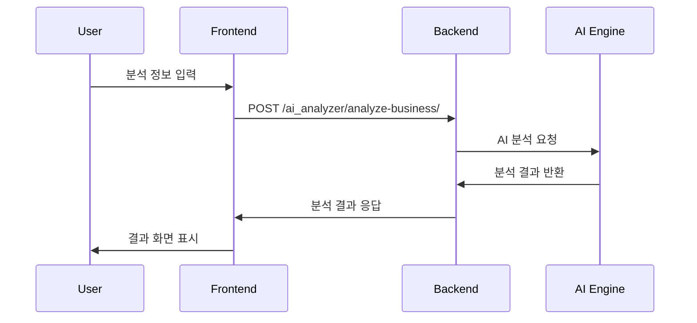
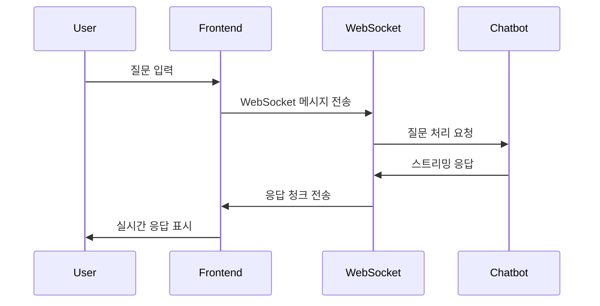

# API 엔드포인트 총정리

## 📋 개요

LocaAI AI_Analyzer 시스템에서 사용되는 모든 API 엔드포인트를 정리한 문서입니다.

---

## 🔌 AI_Analyzer 관련 API

### 1. 상권 분석 API

#### 1.1 비즈니스 분석 요청
```http
POST /ai_analyzer/analyze-business/
Content-Type: application/json
X-CSRFToken: {{ csrf_token }}

{
  "business_type_id": 1,
  "address": "서울시 강남구 테헤란로 123",
  "area": 50.0,
  "service_type": 1,
  "x_coord": 127.0276,
  "y_coord": 37.5013,
  "latitude": 37.5013,
  "longitude": 127.0276
}
```

**응답 예시:**
```json
{
  "success": true,
  "message": "분석이 완료되었습니다.",
  "request_id": 123,
  "is_guest": false,
  "result": {
    "survival_percentage": 85.5,
    "life_pop_300m": 12500,
    "working_pop_300m": 8500,
    "competitor_300m": 15,
    "total_land_value": 150000000,
    "competitor_ratio_300m": 12.5,
    "business_diversity_300m": 0.85,
    "2A_Temp_Total": 2500,
    "1A_Long_Total": 1800,
    "2A_Long_CN": 15.5,
    "2A_20": 18.5,
    "2A_30": 25.2,
    "2A_40": 22.8,
    "2A_50": 20.1,
    "2A_60": 13.4
  }
}
```

#### 1.2 분석 결과 조회
```http
GET /ai_analyzer/get-analysis-result/{request_id}/
```

**응답 예시:**
```json
{
  "success": true,
  "data": {
    "request": {
      "id": 123,
      "address": "서울시 강남구 테헤란로 123",
      "business_type": {
        "id": 1,
        "name": "카페"
      },
      "area": 50.0,
      "service_type": {
        "id": 1,
        "name": "일반음식점"
      },
      "created_at": "2025-06-18T04:18:43Z"
    },
    "result": {
      "survival_percentage": 85.5,
      "life_pop_300m": 12500,
      "working_pop_300m": 8500,
      "competitor_300m": 15,
      "total_land_value": 150000000
    }
  }
}
```

#### 1.3 분석 페이지 접근
```http
GET /ai_analyzer/analyze/
```

**응답**: HTML 페이지 (analyze.html)

---

## 🤖 챗봇 관련 API

### 2. WebSocket 연결

#### 2.1 WebSocket 엔드포인트
```javascript
// WebSocket 연결 설정
const protocol = window.location.protocol === 'https:' ? 'wss:' : 'ws:';
const wsUrl = `${protocol}//${window.location.host}/ws/chatbot/`;
const chatSocket = new WebSocket(wsUrl);
```

#### 2.2 메시지 전송 형식
```javascript
// 메시지 전송
chatSocket.send(JSON.stringify({
  user_id: 1,
  session_id: "session_123",
  question: "이 상권의 생존 확률이 높은 이유는 무엇인가요?",
  collection: "analysis_result_consultation"
}));
```

#### 2.3 응답 메시지 형식
```javascript
// 스트리밍 응답
{
  "chunk": "분석 결과를 바탕으로 말씀드리면...",
  "session_id": "session_123"
}

// 응답 완료
{
  "done": true,
  "session_id": "session_123"
}

// 오류 발생
{
  "error": "오류 메시지",
  "session_id": "session_123"
}
```

---

## 📄 PDF 생성 API

### 3. PDF 다운로드

#### 3.1 PDF 생성 요청
```http
POST /generate-pdf/
Content-Type: application/json
X-CSRFToken: {{ csrf_token }}

{
  "request_id": 123,
  "format": "high_quality"  // 또는 "lightweight"
}
```

**응답**:
- 성공 시: PDF 파일 다운로드 (application/pdf)
- 실패 시: JSON 오류 메시지

```json
{
  "success": false,
  "error": "분석 결과를 찾을 수 없습니다."
}
```

---

## 🗺️ 주소 검색 API

### 4. 카카오 주소 검색 API

#### 4.1 주소 검색 (카카오 API 연동)
```javascript
// 카카오 Postcode API 사용
// 구체적인 구현은 카카오 개발자 문서 참조
new daum.Postcode({
  oncomplete: function(data) {
    // 주소 선택 완료 시 콜백
    console.log(data);
  }
}).open();
```

#### 4.2 좌표 변환 (카카오 지도 API)
```javascript
// 주소 → 좌표 변환
const geocoder = new kakao.maps.services.Geocoder();
geocoder.addressSearch(address, function(result, status) {
  if (status === kakao.maps.services.Status.OK) {
    const coords = new kakao.maps.LatLng(result[0].y, result[0].x);
    // 좌표 사용
  }
});
```

---

## 📁 정적 파일 API

### 5. 정적 파일 서빙

#### 5.1 JavaScript 파일
```http
GET /static/assets/js/main.js
GET /static/assets/js/chart.js
```

#### 5.2 CSS 파일
```http
GET /static/assets/css/style.css
GET /static/assets/css/bootstrap.min.css
```

#### 5.3 이미지 파일
```http
GET /static/assets/images/logo.png
GET /static/assets/images/favicon.ico
```

---

## 🔐 인증 관련 API

### 6. 사용자 인증

#### 6.1 로그인 상태 확인
```javascript
// 템플릿에서 사용자 정보 확인

  // 로그인된 사용자
  user_id: {{ user.id }}

  // 비회원 사용자
  user_id: null

```

#### 6.2 CSRF 토큰
```javascript
// CSRF 토큰 사용
const csrfToken = '{{ csrf_token }}';

// Ajax 요청 시 헤더에 포함
headers: {
  'X-CSRFToken': csrfToken
}
```

---

## 🔄 데이터 플로우

### 7. 전체 API 호출 순서

#### 7.1 상권 분석 플로우


#### 7.2 채팅 플로우


---

## 📊 API 응답 코드

### 8. HTTP 상태 코드

#### 8.1 성공 응답
- `200 OK`: 정상 처리
- `201 Created`: 리소스 생성 성공

#### 8.2 클라이언트 오류
- `400 Bad Request`: 잘못된 요청
- `401 Unauthorized`: 인증 필요
- `403 Forbidden`: 접근 권한 없음
- `404 Not Found`: 리소스 없음

#### 8.3 서버 오류
- `500 Internal Server Error`: 서버 내부 오류
- `502 Bad Gateway`: 게이트웨이 오류
- `503 Service Unavailable`: 서비스 사용 불가

---

## 🛠️ API 테스트

### 9. 테스트 도구

#### 9.1 cURL 예시
```bash
# 상권 분석 요청
curl -X POST http://localhost:8000/ai_analyzer/analyze-business/ \
  -H "Content-Type: application/json" \
  -H "X-CSRFToken: YOUR_CSRF_TOKEN" \
  -d '{
    "business_type_id": 1,
    "address": "서울시 강남구 테헤란로 123",
    "area": 50.0,
    "service_type": 1,
    "x_coord": 127.0276,
    "y_coord": 37.5013,
    "latitude": 37.5013,
    "longitude": 127.0276
  }'
```

#### 9.2 JavaScript 테스트
```javascript
// 분석 결과 조회 테스트
fetch('/ai_analyzer/get-analysis-result/123/')
  .then(response => response.json())
  .then(data => console.log(data))
  .catch(error => console.error('Error:', error));
```

---

## 📈 성능 최적화

### 10. API 최적화 전략

#### 10.1 캐싱 전략
- 분석 결과 캐싱 (Redis)
- 정적 파일 브라우저 캐싱
- API 응답 압축 (gzip)

#### 10.2 요청 최적화
- 불필요한 데이터 제거
- 페이지네이션 구현
- 배치 요청 처리

---

**문서 작성일**: 2025년 6월 18일  
**작성자**: AI Assistant  
**버전**: 1.0 